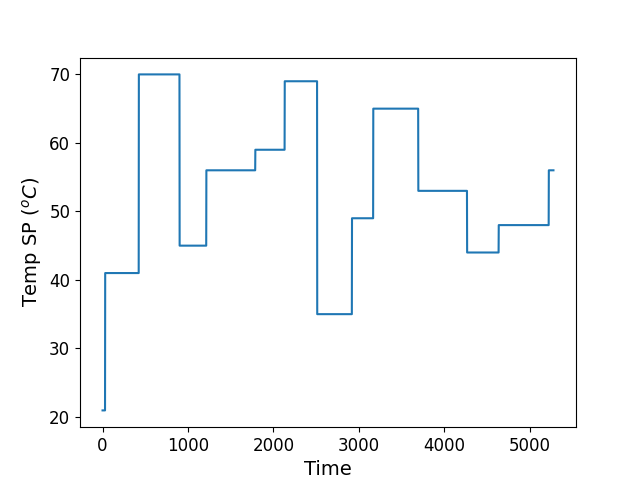

# ITCLab Control LSTM Based

This repository contains the implementation of the PID, PID deep learning, and LSTM-based method for ITCLab Kit. 

## Member Group :
1. Nadila Intan Puspitasari		(20081010028)
2. Vanessa Afyta Faradhilla		(20081010027)
3. Hanif Al Fathoni				(20081010001)
4. Novandi Kevin Pratama		(20081010005)

For more information, please refer to the report in this repository :

https://drive.google.com/file/d/1lwrPwDbtuim6vQ0s80sFZx_XqAUFwq6A/view?usp=sharing

## Contents

1. Introduction
2. Required program files
3. Results

## Introduction

The goal of this project is to compare the performance of three different method for temperature control: PID, PID deep learning, and LSTM-based models for ITCLab Kit.

## Required program files:
The files needed to run the iTCLab Kit test using LSTM Based Controller, namely:

1. Programs must be uploaded in the iTCLab Kit (05-iTCLab_PID.ino) https://github.com/bsrahmat/itclab-06/blob/main/05-iTCLab_PID.ino.
2. Module Program File (itclab.py) https://github.com/novandikp/itclab_lstm_control/blob/main/itclab.py
3. Script Program to run the iTCLab Kit Testing process using Python Jupyter Notebook (LSTM_Control_Based.ipynb) https://github.com/novandikp/itclab_lstm_control/blob/main/LSTM_Control_Based.ipynb

## Results

Setpoint Train Data

### Performance Comparison
Comparison of the performance metrics for each method, including rise time, settling time, and overshoot.

.png)
.png)
.png)

